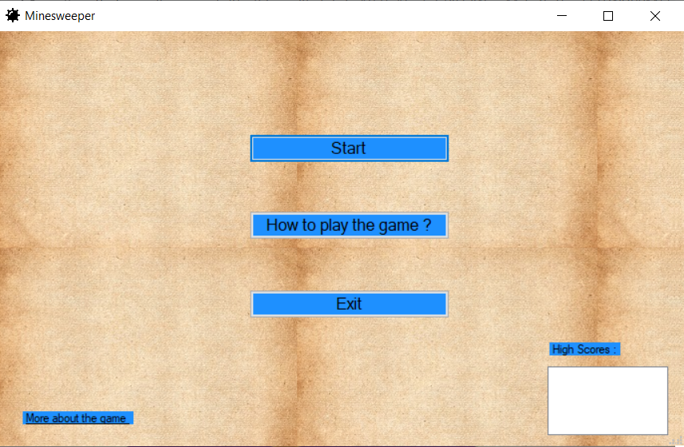
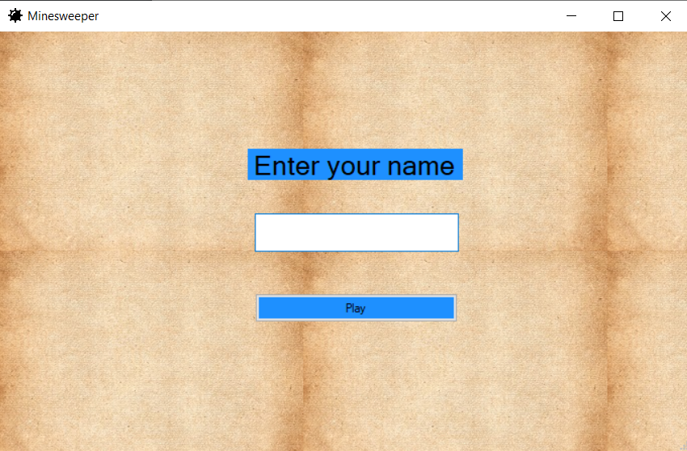
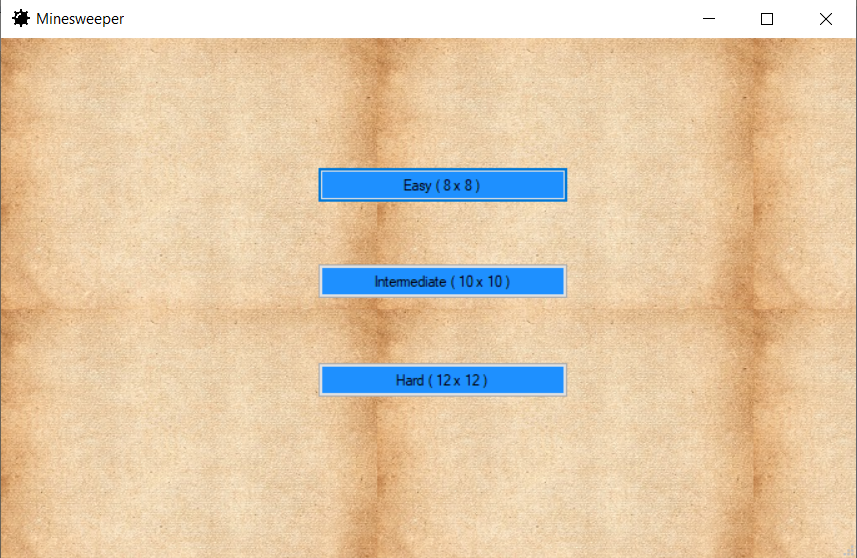
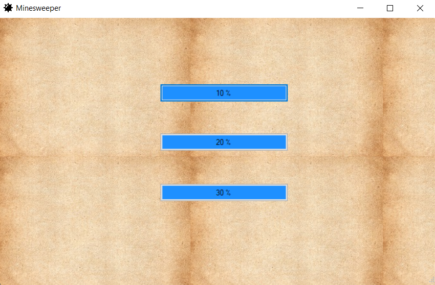
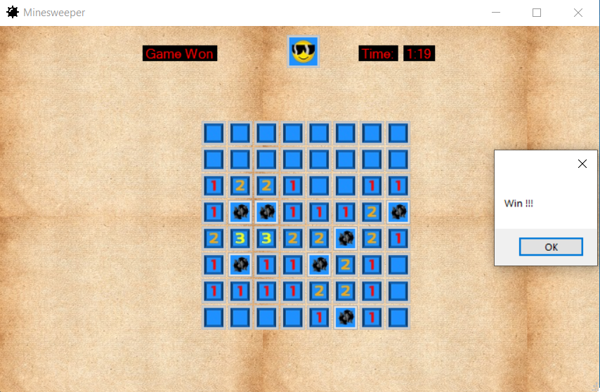
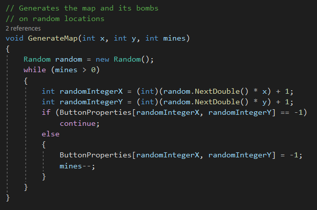
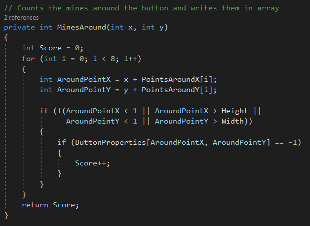
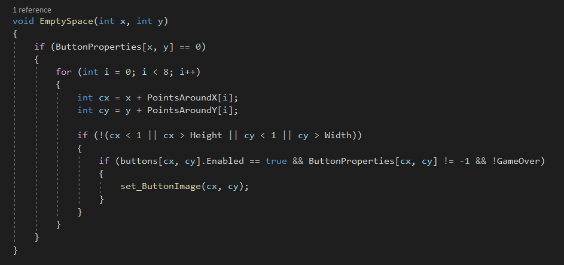

# Minesweeper

# Проект по Визуелно Програмирање
Нашиот проект e базиран на играта Minesweeper и представува имплементација на истата. Главна цел на играта е ,,чистење” на целото поле од мини.

# Опис на играта
Minesweeper играта е логичка (puzzle) игра за еден човек.

Првите затечоци на играта се појавуваат во 1960-те додека препознатливата класична Minesweeper игра станува популарна во 1980-те.

На почетокот на играта добиваме дво-димензионална матрица од блокови (buttons) кој можат да бидат отворени.

Играта се смета за успешно завршена кога ке бидат отворени сите полиња кој не се мини. 

Играта започнува со отварање на одреден блок, а со тоа започнува и тајмерот на играта. Со отварање на  било кој блок се појавуваат бројки (од 1 до 8) чие што значење е бројот на мини околу тој блок.

НАПОМЕНА : Првиот блок не смее да биде мина.

Начинот на броење на мините околу е така што од целосната матрица се зема како 3x3 подматрица со тоа што за центар на подматрицата се смета блокот кој е отворен (горе, долу, лево, десно и соодветна комбинација од истите блокови околу централниот). Бројот кој го добиваме по отварање на блокот е бројот на мини во 3x3 подматрицата. Исклучок се подматриците кој не се целосни. Тие се појавуваат кај блоковите кој се наоѓаат на работ од матрицата. Доколку блкот се наоѓа во агол подматрицата ке има 4 блока а доколку на раб 6 блока.

Со помош на бројките и логичка елиминација се пронаоѓаат миниите и нивните локации. При успешно завршена игра резултатите (времето) се запишува и се прикажуваат најдобрите играчи. 

Доколку при отварањето играчот отвори мини играта се смета за неуспешно завршена.

# Screenshots и упатство за играње
На почеток кога се вклучува играта се стартува главното мени.

Овде имаме неколку опции како што се стартување на играта, исклучување на играата, како да ја играте играта и информации за играта. Во долниот десен агол ги гледаме податоците за најдобрите играчи.

Со стартување на играта се појавуваат следните прозорци еден по еден каде што го внесуваме нашето име, избираме големината на табелата и бројот на бомби после кое стартуваме со играње на играта.

Кога играчот ќе ја победи играта добиваме порака Win, а кога ќе добие изгуби добива порака Game Over после после кои што се враќа на почетното мени. Доколку играчот победил и се наоѓа во топ 5 места неговите податоци се зачувуваат во листата во стартното мени сортирани по опаѓачки редослед.

# Упатство
Играта се игра само со глувче. Играчот треба со глувчето да клика врз копчињата кои се поставени во табела. Играчот има две опции за кликање и тоа со лев и десен клик на глушецот со кој ја игра играта. Кога ќе кликне на левиот клик, тоа значи дека го отвара тоа поле, а со кликање на десен клик означува дека на тоа копче од табелата има мина. Кога играчот кликнува со лев клик и таму нема мина добиваме број кој означува колку мини има околу тоа поле а ако погодите мина играта завршува. Со кликање на десен клик означувате дека на тоа поле има мина.
Бројот кој го добиваме со отварање на поле од табелата означува колку мини има околу тоа поле што значи дека може да ни се појави бројот 1, 2, 3, 4, 5, 6, 7, 8.
Со означување на поле каде што мислите дека има мина се појавува знаменце.
Откако ќе ги обележите сите мини со десен клик во табелата ги отвараме преостанатите полиња и играта завршуава со победа.

# Имплементација
Нашата имплементација се вооглавно е организирана во формите Player, NumberOfBombs, Difficulty, GameMain.

Во формата  Player се внесува податокот за името на играчот, NumberOfBombs е формата во која се избира процентот на бомби при играње на играта додека во Difficulty се избира големината на на матрицата која ке се користи за играта 

Сите овие информации се складираат во објект кој е дел од класата Player кој ги користиме при успешно завршување на играта и потребата да се запишат податоците во база видлива во почетната форма на играта 

Најголемиот дел од од имплементацијата на целата игра се случува во GameMain формата. Првично се креираат матрица од копчиња распоредени со помош на координати во просторот и со помош на функции во позадина се додаваат рандом бомби во матрицата. Големита на матрицата и бројот на бомбите во неа се добиваат како информации од претходно наведените форми. Покрај додавањето копчиња и бомби на мапата се прават пресметки за бомбите околу секое поле на матрицата. Овие податоци се чуваат во две посебни матрици од цели броеви. Едната матрица ButtonProperties ја користиме за моменталните вредности на копчето додека SavedButtonProperties се користи за ресетирање на вредноста. Главна функционалност е додавање на EventHandler при лев или десен клик на било кое копче. 

Левото копче е отварање на полето и прикажување на бројката колку мини или пак завшување на играта доколку полето е мина.

Исто така имаме и функционалност при десен клик се додава знаме чија рандом вредност е 9 во нашиот код и при вракање на претходната вредност при повторен десен клик се користи SavedButtonProperties

Финалнта имплементација е со помош на функциите за проверка за исполнување на целта (сите полиња кој не се мини да се отворени) и откривање на мапата (мапата е различна при успешно и неуспшно завршување)

# Опис на класа или функција

GenerateMap е функција во класата GameMain со која што ги генерираме мините во табелата од полиња. Бидејќи табелата ни е дводимензионална матрица од копчиња ние пресметуваме рандом броеви и на тоа место поставуваме мина тоа се повторува се додека бројот на мини е поголем од нула во зависност од изборот на мини во табелата од страна на играчот.

Со функцијата MinesAround се одредува бројот на мини околу секое поле со помош на две низи кои што ги претставуваат координатите на сите соседи и притоа се проверува дали точката која што е кликната не излегува од границите на табелата.

Со функцијата EmptySpace извршува задача на откривање на сите соседни полиња се додека не сретне мина.

# Изработиле:
  - Никола Савев 171197
  - Климент Тодоровски 171164
  
  
